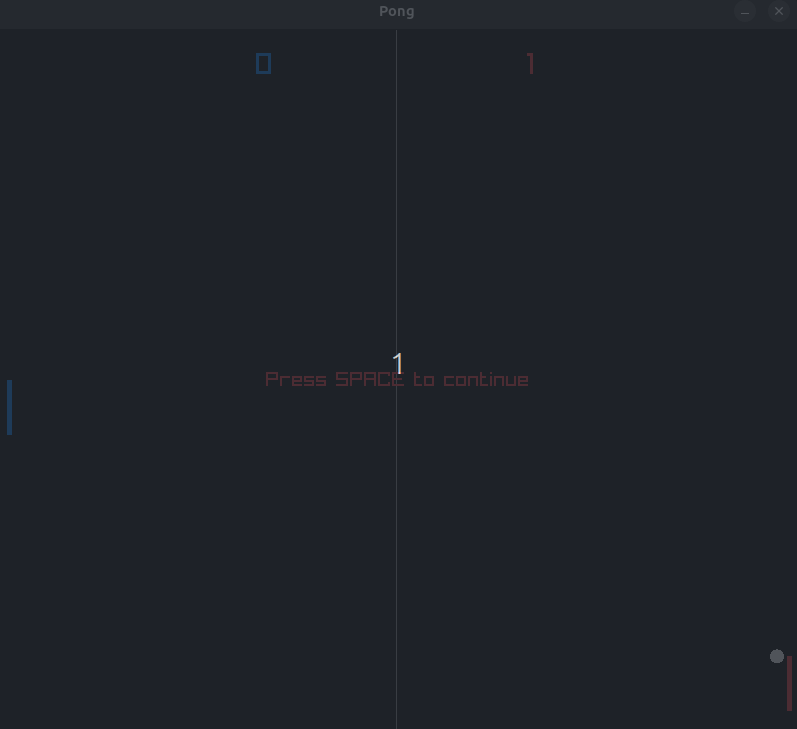

# Pong in C with Raylib

This is a simple implementation of the classic Pong game, developed in C using the [Raylib](https://www.raylib.com/) library.



## How to Play

- **Player:** Use the **UP** and **DOWN** arrow keys to move your blue paddle.
- **AI:** The red paddle is controlled by the computer.
- **Pause:** After each point, press **SPACE** to resume the game.
- **Exit:** Press **ESC** to close the game window.

## Requirements

- [Raylib](https://www.raylib.com/) installed on your system.
- C compiler (e.g., gcc).

## Building

To compile the game, run:

```sh
make
```

To run the game:

```sh
make run
```

To clean up generated files:

```sh
make clean
```

## Project Structure

- `pong.c`: Main game source code.
- `Makefile`: Build, run, and clean commands.
- `.gitignore`: Files and folders ignored by git.

## Game Logic

- The game runs in a main loop, updating positions, checking collisions, and drawing elements on the screen.
- The AI paddle only moves when the ball is moving towards it.
- The score is displayed at the top of the screen.
- The ball is paused at the center after each point, waiting for the player to press space.

## Credits

Developed by Pedro Lapenta.

---

Feel free to modify and experiment!